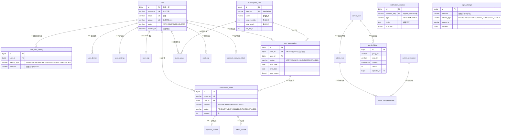

# ZhiYu-Backend 数据库设计

> 本文档基于 [设计规格](superpowers/specs/2026-05-17-zhiyu-backend-design.md) 的领域模型，生成完整 DDL、索引设计和 Flyway 迁移策略。表命名和索引规范遵循 [DEVELOPMENT-STANDARDS.md](../DEVELOPMENT-STANDARDS.md#6-数据库与缓存键名规范)。

## 1. 命名约定

| 规则 | 示例 |
|------|------|
| 表名单数 snake_case | `user`, `user_auth_identity` |
| admin 表用 `admin_` 前缀 | `admin_user`, `admin_role` |
| 主键统一 `id BIGINT AUTO_INCREMENT` | |
| 外键 `xxx_id` | `user_id`, `plan_id` |
| 布尔 `is_xxx` / `has_xxx` | `email_verified`, `auto_renew` |
| 时间 `xxx_at` (DATETIME(3)) | `created_at`, `updated_at` |
| JSON 字段 `xxx_json` (JSON 类型) | `detail_json` |
| 索引 `idx_<table>_<col>` / `uk_<table>_<col>` | `uk_user_email` |

---

## 2. ER 关系概述

```
user ──1:N── user_auth_identity      (一个用户多种登录方式)
user ──1:1── user_subscription       (一个用户一个活跃订阅)
user ──1:N── subscription_order      (一个用户多个订单)
user ──1:N── payment_record          (一个用户多条支付记录)

subscription_plan ──1:N── user_subscription
subscription_order ──1:1── payment_record

admin_user ──M:1── admin_role
admin_role ──M:N── admin_permission  (via admin_role_permission)

user ──1:N── audit_log               (操作审计)
user ──1:N── quota_usage             (配额用量)
```

---

## 3. 完整 DDL

### 3.1 用户核心表

```sql
-- ============================================================
-- V1.0.0__init_schema.sql
-- ============================================================

CREATE TABLE user (
    id              BIGINT          NOT NULL AUTO_INCREMENT  COMMENT '用户ID',
    username        VARCHAR(32)     NOT NULL                 COMMENT '用户名',
    email           VARCHAR(254)    DEFAULT NULL             COMMENT '邮箱',
    email_verified  TINYINT(1)      NOT NULL DEFAULT 0      COMMENT '邮箱是否已验证',
    phone           VARCHAR(20)     DEFAULT NULL             COMMENT '手机号 (E.164)',
    phone_verified  TINYINT(1)      NOT NULL DEFAULT 0      COMMENT '手机号是否已验证',
    password_hash   VARCHAR(60)     DEFAULT NULL             COMMENT 'BCrypt hash (PASSWORD登录方式才有)',
    nickname        VARCHAR(64)     DEFAULT NULL             COMMENT '昵称',
    avatar_url      VARCHAR(512)    DEFAULT NULL             COMMENT '头像OSS URL',
    status          VARCHAR(16)     NOT NULL DEFAULT 'ACTIVE' COMMENT 'ACTIVE|DISABLED|DELETED',
    deleted_at      DATETIME(3)     DEFAULT NULL             COMMENT '注销时间 (30天冷却)',
    created_at      DATETIME(3)     NOT NULL DEFAULT CURRENT_TIMESTAMP(3) COMMENT '注册时间',
    updated_at      DATETIME(3)     NOT NULL DEFAULT CURRENT_TIMESTAMP(3) ON UPDATE CURRENT_TIMESTAMP(3) COMMENT '更新时间',
    PRIMARY KEY (id),
    UNIQUE KEY uk_user_username (username),
    UNIQUE KEY uk_user_email (email),
    UNIQUE KEY uk_user_phone (phone),
    KEY idx_user_status (status),
    KEY idx_user_created_at (created_at),
    KEY idx_user_deleted_at (deleted_at)
) ENGINE=InnoDB DEFAULT CHARSET=utf8mb4 COLLATE=utf8mb4_unicode_ci COMMENT='用户表';
```

```sql
CREATE TABLE user_auth_identity (
    id              BIGINT          NOT NULL AUTO_INCREMENT  COMMENT '身份ID',
    user_id         BIGINT          NOT NULL                 COMMENT '用户ID',
    identity_type   VARCHAR(16)     NOT NULL                 COMMENT 'WECHAT|QQ|PHONE|EMAIL|GOOGLE|APPLE|WEBAUTHN|PASSWORD',
    identifier      VARCHAR(512)    NOT NULL                 COMMENT 'openid/手机号/邮箱/credentialId',
    credential      VARCHAR(255)    DEFAULT NULL             COMMENT '仅PASSWORD存BCrypt hash，其他类型为NULL',
    last_used_at    DATETIME(3)     DEFAULT NULL             COMMENT '最后使用时间',
    created_at      DATETIME(3)     NOT NULL DEFAULT CURRENT_TIMESTAMP(3),
    PRIMARY KEY (id),
    UNIQUE KEY uk_user_auth_identity_type_idfr (identity_type, identifier),
    KEY idx_user_auth_identity_user (user_id),
    CONSTRAINT fk_auth_identity_user FOREIGN KEY (user_id) REFERENCES user(id)
) ENGINE=InnoDB DEFAULT CHARSET=utf8mb4 COLLATE=utf8mb4_unicode_ci COMMENT='用户认证身份表';
```

```sql
CREATE TABLE user_device (
    id              BIGINT          NOT NULL AUTO_INCREMENT  COMMENT '记录ID',
    user_id         BIGINT          NOT NULL                 COMMENT '用户ID',
    device_id       CHAR(36)        NOT NULL                 COMMENT '设备UUID (客户端生成)',
    device_name     VARCHAR(128)    DEFAULT NULL             COMMENT '设备名称',
    platform        VARCHAR(16)     DEFAULT NULL             COMMENT 'IOS|ANDROID|WEB',
    push_token      VARCHAR(512)    DEFAULT NULL             COMMENT '推送token (FCM/APNs/个推)',
    trusted_for_totp TINYINT(1)     NOT NULL DEFAULT 0      COMMENT '是否信任跳过TOTP',
    last_active_at  DATETIME(3)     NOT NULL DEFAULT CURRENT_TIMESTAMP(3) COMMENT '最后活跃时间',
    created_at      DATETIME(3)     NOT NULL DEFAULT CURRENT_TIMESTAMP(3),
    PRIMARY KEY (id),
    UNIQUE KEY uk_user_device (user_id, device_id),
    KEY idx_user_device_last_active (user_id, last_active_at)
) ENGINE=InnoDB DEFAULT CHARSET=utf8mb4 COLLATE=utf8mb4_unicode_ci COMMENT='用户设备表';
```

```sql
CREATE TABLE user_settings (
    user_id             BIGINT          NOT NULL               COMMENT '用户ID (1:1)',
    notification_email  TINYINT(1)      NOT NULL DEFAULT 1    COMMENT '邮件通知',
    notification_push   TINYINT(1)      NOT NULL DEFAULT 1    COMMENT '推送通知',
    notification_sms    TINYINT(1)      NOT NULL DEFAULT 0    COMMENT '短信通知',
    show_online_status  TINYINT(1)      NOT NULL DEFAULT 1    COMMENT '在线状态可见',
    language            VARCHAR(8)      NOT NULL DEFAULT 'zh-CN',
    timezone            VARCHAR(32)     NOT NULL DEFAULT 'Asia/Shanghai',
    updated_at          DATETIME(3)     NOT NULL DEFAULT CURRENT_TIMESTAMP(3) ON UPDATE CURRENT_TIMESTAMP(3),
    PRIMARY KEY (user_id),
    CONSTRAINT fk_settings_user FOREIGN KEY (user_id) REFERENCES user(id)
) ENGINE=InnoDB DEFAULT CHARSET=utf8mb4 COLLATE=utf8mb4_unicode_ci COMMENT='用户设置表';
```

### 3.2 TOTP 相关

```sql
CREATE TABLE user_totp (
    user_id         BIGINT          NOT NULL                   COMMENT '用户ID',
    secret          VARCHAR(64)     NOT NULL                   COMMENT 'TOTP secret (Base32)',
    enabled         TINYINT(1)      NOT NULL DEFAULT 0        COMMENT '是否已启用',
    recovery_codes  JSON            DEFAULT NULL               COMMENT '恢复码列表 (h(bcrypt) 存储)',
    created_at      DATETIME(3)     NOT NULL DEFAULT CURRENT_TIMESTAMP(3),
    updated_at      DATETIME(3)     NOT NULL DEFAULT CURRENT_TIMESTAMP(3) ON UPDATE CURRENT_TIMESTAMP(3),
    PRIMARY KEY (user_id),
    CONSTRAINT fk_totp_user FOREIGN KEY (user_id) REFERENCES user(id)
) ENGINE=InnoDB DEFAULT CHARSET=utf8mb4 COLLATE=utf8mb4_unicode_ci COMMENT='用户TOTP设置表';
```

### 3.3 订阅与支付

```sql
CREATE TABLE subscription_plan (
    id              BIGINT          NOT NULL AUTO_INCREMENT  COMMENT '套餐ID',
    plan_key        VARCHAR(32)     NOT NULL                 COMMENT '套餐标识 free|lite|pro',
    name            VARCHAR(64)     NOT NULL                 COMMENT '套餐名称',
    description     VARCHAR(512)    DEFAULT NULL             COMMENT '简介',
    price_monthly   INT             NOT NULL DEFAULT 0      COMMENT '月价(分)',
    price_yearly    INT             NOT NULL DEFAULT 0      COMMENT '年价(分)',
    trial_days      INT             NOT NULL DEFAULT 0      COMMENT '试用天数 (0=不开放)',
    features_json   JSON            NOT NULL                 COMMENT '功能列表JSON ["basic_chat",...]',
    quotas_json     JSON            NOT NULL                 COMMENT '配额JSON {"daily_chat":200,...}',
    is_active       TINYINT(1)      NOT NULL DEFAULT 1      COMMENT '是否上架',
    sort_order      INT             NOT NULL DEFAULT 0      COMMENT '排序权重',
    created_at      DATETIME(3)     NOT NULL DEFAULT CURRENT_TIMESTAMP(3),
    updated_at      DATETIME(3)     NOT NULL DEFAULT CURRENT_TIMESTAMP(3) ON UPDATE CURRENT_TIMESTAMP(3),
    PRIMARY KEY (id),
    UNIQUE KEY uk_plan_key (plan_key)
) ENGINE=InnoDB DEFAULT CHARSET=utf8mb4 COLLATE=utf8mb4_unicode_ci COMMENT='套餐定义表';
```

```sql
CREATE TABLE user_subscription (
    id                  BIGINT          NOT NULL AUTO_INCREMENT  COMMENT '订阅ID',
    user_id             BIGINT          NOT NULL                 COMMENT '用户ID',
    plan_id             BIGINT          NOT NULL                 COMMENT '套餐ID',
    status              VARCHAR(16)     NOT NULL DEFAULT 'ACTIVE' COMMENT 'ACTIVE|CANCELING|EXPIRED|REFUNDED',
    start_date          DATE            NOT NULL                 COMMENT '开始日期',
    end_date            DATE            NOT NULL                 COMMENT '结束日期',
    auto_renew          TINYINT(1)      NOT NULL DEFAULT 0      COMMENT '是否自动续费',
    pending_downgrade   VARCHAR(32)     DEFAULT NULL             COMMENT '预约降级目标 plan_key',
    trial_used          TINYINT(1)      NOT NULL DEFAULT 0      COMMENT '是否已使用试用',
    cancelled_at        DATETIME(3)     DEFAULT NULL             COMMENT '取消时间',
    created_at          DATETIME(3)     NOT NULL DEFAULT CURRENT_TIMESTAMP(3),
    updated_at          DATETIME(3)     NOT NULL DEFAULT CURRENT_TIMESTAMP(3) ON UPDATE CURRENT_TIMESTAMP(3),
    PRIMARY KEY (id),
    UNIQUE KEY uk_subscription_user (user_id),
    KEY idx_subscription_status (status),
    KEY idx_subscription_end_date (end_date),
    CONSTRAINT fk_subscription_user FOREIGN KEY (user_id) REFERENCES user(id),
    CONSTRAINT fk_subscription_plan FOREIGN KEY (plan_id) REFERENCES subscription_plan(id)
) ENGINE=InnoDB DEFAULT CHARSET=utf8mb4 COLLATE=utf8mb4_unicode_ci COMMENT='用户订阅表';
```

```sql
CREATE TABLE subscription_order (
    id                  BIGINT          NOT NULL AUTO_INCREMENT  COMMENT '订单ID',
    order_no            VARCHAR(32)     NOT NULL                 COMMENT '订单号 ZY+yyyyMMdd+6位序号',
    user_id             BIGINT          NOT NULL                 COMMENT '用户ID',
    plan_id             BIGINT          NOT NULL                 COMMENT '套餐ID',
    plan_key            VARCHAR(32)     NOT NULL                 COMMENT '冗余套餐标识',
    period              VARCHAR(8)      NOT NULL                 COMMENT 'MONTHLY|YEARLY',
    amount              INT             NOT NULL                 COMMENT '金额(分)',
    original_amount     INT             DEFAULT NULL             COMMENT '原始金额(分)(升级折价时)',
    currency            VARCHAR(4)      NOT NULL DEFAULT 'CNY'  COMMENT '币种',
    channel             VARCHAR(16)     NOT NULL                 COMMENT 'WECHAT|ALIPAY|APPLE|GOOGLE',
    status              VARCHAR(16)     NOT NULL DEFAULT 'PENDING' COMMENT 'PENDING|PAID|CANCELLED|EXPIRED|REFUNDED',
    transaction_id      VARCHAR(128)    DEFAULT NULL             COMMENT '第三方交易号',
    prepay_info_json    JSON            DEFAULT NULL             COMMENT '预支付信息 (仅服务端起单的渠道)',
    paid_at             DATETIME(3)     DEFAULT NULL             COMMENT '支付时间',
    created_at          DATETIME(3)     NOT NULL DEFAULT CURRENT_TIMESTAMP(3),
    updated_at          DATETIME(3)     NOT NULL DEFAULT CURRENT_TIMESTAMP(3) ON UPDATE CURRENT_TIMESTAMP(3),
    PRIMARY KEY (id),
    UNIQUE KEY uk_order_no (order_no),
    KEY idx_order_user (user_id),
    KEY idx_order_status (status),
    KEY idx_order_channel_trans (channel, transaction_id),
    KEY idx_order_created (created_at),
    CONSTRAINT fk_order_user FOREIGN KEY (user_id) REFERENCES user(id)
) ENGINE=InnoDB DEFAULT CHARSET=utf8mb4 COLLATE=utf8mb4_unicode_ci COMMENT='订阅订单表';
```

```sql
CREATE TABLE payment_record (
    id                  BIGINT          NOT NULL AUTO_INCREMENT  COMMENT '支付记录ID',
    order_id            BIGINT          NOT NULL                 COMMENT '订单ID',
    user_id             BIGINT          NOT NULL                 COMMENT '冗余用户ID',
    channel             VARCHAR(16)     NOT NULL                 COMMENT 'WECHAT|ALIPAY|APPLE|GOOGLE',
    transaction_id      VARCHAR(128)    NOT NULL                 COMMENT '第三方交易号',
    amount              INT             NOT NULL                 COMMENT '金额(分)',
    currency            VARCHAR(4)      NOT NULL DEFAULT 'CNY'  COMMENT '币种',
    status              VARCHAR(16)     NOT NULL                 COMMENT 'SUCCESS|REFUND|FAIL',
    raw_notification    JSON            DEFAULT NULL             COMMENT '原始回调JSON (审计)',
    reconciliation_status VARCHAR(16)   DEFAULT NULL             COMMENT 'MATCH|MISMATCH|ONLY_LOCAL|ONLY_REMOTE',
    reconciliation_note VARCHAR(255)    DEFAULT NULL             COMMENT '对账差异备注',
    paid_at             DATETIME(3)     DEFAULT NULL,
    created_at          DATETIME(3)     NOT NULL DEFAULT CURRENT_TIMESTAMP(3),
    PRIMARY KEY (id),
    UNIQUE KEY uk_payment_transaction (channel, transaction_id),
    KEY idx_payment_order (order_id),
    KEY idx_payment_user (user_id),
    KEY idx_payment_reconciliation (reconciliation_status),
    CONSTRAINT fk_payment_order FOREIGN KEY (order_id) REFERENCES subscription_order(id)
) ENGINE=InnoDB DEFAULT CHARSET=utf8mb4 COLLATE=utf8mb4_unicode_ci COMMENT='支付记录表';
```

```sql
CREATE TABLE quota_usage (
    id              BIGINT          NOT NULL AUTO_INCREMENT  COMMENT '用量ID',
    user_id         BIGINT          NOT NULL                 COMMENT '用户ID',
    quota_key       VARCHAR(32)     NOT NULL                 COMMENT '配额标识 daily_chat|file_upload_mb|image_gen_daily',
    used_count      BIGINT          NOT NULL DEFAULT 0      COMMENT '已用量',
    version         INT             NOT NULL DEFAULT 0      COMMENT '乐观锁版本号',
    period_start    DATE            NOT NULL                 COMMENT '周期开始',
    period_end      DATE            NOT NULL                 COMMENT '周期结束',
    created_at      DATETIME(3)     NOT NULL DEFAULT CURRENT_TIMESTAMP(3),
    updated_at      DATETIME(3)     NOT NULL DEFAULT CURRENT_TIMESTAMP(3) ON UPDATE CURRENT_TIMESTAMP(3),
    PRIMARY KEY (id),
    UNIQUE KEY uk_quota_user_key_period (user_id, quota_key, period_start),
    KEY idx_quota_period (quota_key, period_start)
) ENGINE=InnoDB DEFAULT CHARSET=utf8mb4 COLLATE=utf8mb4_unicode_ci COMMENT='配额用量表';
```

```sql
CREATE TABLE refund_record (
    id              BIGINT          NOT NULL AUTO_INCREMENT  COMMENT '退款记录ID',
    refund_no       VARCHAR(32)     NOT NULL                 COMMENT '退款单号 RF+日期+序号',
    order_id        BIGINT          NOT NULL                 COMMENT '原订单ID',
    user_id         BIGINT          NOT NULL                 COMMENT '用户ID',
    amount          INT             NOT NULL                 COMMENT '退款金额(分)',
    reason          VARCHAR(16)     NOT NULL                 COMMENT 'DUPLICATE_PURCHASE|ACCIDENTAL|NOT_SATISFIED|OTHER',
    description     VARCHAR(500)    DEFAULT NULL             COMMENT '用户描述',
    status          VARCHAR(16)     NOT NULL DEFAULT 'PENDING_REVIEW' COMMENT 'PENDING_REVIEW|APPROVED|REJECTED|REFUNDED',
    reviewer_id     BIGINT          DEFAULT NULL             COMMENT '审核人ID (admin_user)',
    review_note     VARCHAR(255)    DEFAULT NULL             COMMENT '审核备注',
    channel_refund_id VARCHAR(128)  DEFAULT NULL             COMMENT '渠道退款单号',
    applied_at      DATETIME(3)     NOT NULL DEFAULT CURRENT_TIMESTAMP(3),
    reviewed_at     DATETIME(3)     DEFAULT NULL,
    refunded_at     DATETIME(3)     DEFAULT NULL,
    PRIMARY KEY (id),
    UNIQUE KEY uk_refund_no (refund_no),
    KEY idx_refund_order (order_id),
    KEY idx_refund_user (user_id),
    KEY idx_refund_status (status),
    CONSTRAINT fk_refund_order FOREIGN KEY (order_id) REFERENCES subscription_order(id)
) ENGINE=InnoDB DEFAULT CHARSET=utf8mb4 COLLATE=utf8mb4_unicode_ci COMMENT='退款记录表';
```

### 3.4 账户恢复

```sql
CREATE TABLE account_recovery_ticket (
    id              BIGINT          NOT NULL AUTO_INCREMENT  COMMENT '工单ID',
    ticket_no       VARCHAR(32)     NOT NULL                 COMMENT '工单号 AR+日期+序号',
    user_id         BIGINT          DEFAULT NULL             COMMENT '匹配到的用户ID (审核后确定)',
    submitted_info  JSON            NOT NULL                 COMMENT '用户提交的信息 {"email":"...","phone":"..."}',
    status          VARCHAR(16)     NOT NULL DEFAULT 'PENDING' COMMENT 'PENDING|APPROVED|REJECTED|EXPIRED',
    reviewer_id     BIGINT          DEFAULT NULL             COMMENT '审核人ID',
    review_note     VARCHAR(255)    DEFAULT NULL,
    recovery_token  VARCHAR(128)    DEFAULT NULL             COMMENT '恢复链接token (审核通过后生成)',
    recovery_token_expires DATETIME(3) DEFAULT NULL,
    applied_at      DATETIME(3)     NOT NULL DEFAULT CURRENT_TIMESTAMP(3),
    reviewed_at     DATETIME(3)     DEFAULT NULL,
    expires_at      DATETIME(3)     NOT NULL                 COMMENT '7天后自动关闭',
    PRIMARY KEY (id),
    UNIQUE KEY uk_recovery_ticket_no (ticket_no),
    KEY idx_recovery_ticket_status (status)
) ENGINE=InnoDB DEFAULT CHARSET=utf8mb4 COLLATE=utf8mb4_unicode_ci COMMENT='账户恢复工单表';
```

### 3.5 审计日志

```sql
CREATE TABLE audit_log (
    id              BIGINT          NOT NULL AUTO_INCREMENT  COMMENT '审计ID',
    event_type      VARCHAR(32)     NOT NULL                 COMMENT '事件类型 USER_LOGIN|IDENTITY_BIND|ADMIN_ACTION|CONFIG_CHANGE|...',
    operator_id     BIGINT          DEFAULT NULL             COMMENT '操作人ID',
    operator_type   VARCHAR(8)      NOT NULL                 COMMENT 'ADMIN|USER|SYSTEM',
    target_type     VARCHAR(32)     DEFAULT NULL             COMMENT '目标类型 USER|ORDER|CONFIG|...',
    target_id       VARCHAR(64)     DEFAULT NULL             COMMENT '目标ID',
    action          VARCHAR(64)     NOT NULL                 COMMENT '具体动作',
    detail_json     JSON            DEFAULT NULL             COMMENT '变更详情 {field, oldValue, newValue}',
    source_ip       VARCHAR(45)     DEFAULT NULL             COMMENT '来源IP (IPv4/IPv6)',
    ip_geo          VARCHAR(64)     DEFAULT NULL             COMMENT 'IP地理位置',
    device_id       CHAR(36)        DEFAULT NULL             COMMENT '设备ID',
    user_agent      VARCHAR(512)    DEFAULT NULL             COMMENT 'User-Agent',
    request_id      CHAR(36)        DEFAULT NULL             COMMENT '请求ID (traceId)',
    created_at      DATETIME(3)     NOT NULL DEFAULT CURRENT_TIMESTAMP(3),
    PRIMARY KEY (id),
    KEY idx_audit_event_type (event_type, created_at),
    KEY idx_audit_operator (operator_id, created_at),
    KEY idx_audit_target (target_type, target_id),
    KEY idx_audit_created (created_at),
    KEY idx_audit_request (request_id)
) ENGINE=InnoDB DEFAULT CHARSET=utf8mb4 COLLATE=utf8mb4_unicode_ci COMMENT='审计日志表';
```

### 3.6 管理后台表

```sql
CREATE TABLE admin_role (
    id              BIGINT          NOT NULL AUTO_INCREMENT  COMMENT '角色ID',
    role_code       VARCHAR(16)     NOT NULL                 COMMENT 'SUPER_ADMIN|ADMIN|CS',
    role_name       VARCHAR(32)     NOT NULL                 COMMENT '角色名称',
    description     VARCHAR(128)    DEFAULT NULL,
    created_at      DATETIME(3)     NOT NULL DEFAULT CURRENT_TIMESTAMP(3),
    PRIMARY KEY (id),
    UNIQUE KEY uk_admin_role_code (role_code)
) ENGINE=InnoDB DEFAULT CHARSET=utf8mb4 COLLATE=utf8mb4_unicode_ci COMMENT='管理后台角色表';
```

```sql
CREATE TABLE admin_permission (
    id              BIGINT          NOT NULL AUTO_INCREMENT  COMMENT '权限ID',
    perm_code       VARCHAR(64)     NOT NULL                 COMMENT '权限码 users|users.export|dashboard|...',
    perm_name       VARCHAR(64)     NOT NULL                 COMMENT '权限名称',
    perm_type       VARCHAR(8)      NOT NULL                 COMMENT 'MENU|BUTTON|API',
    parent_id       BIGINT          DEFAULT NULL             COMMENT '父权限ID (菜单层级)',
    created_at      DATETIME(3)     NOT NULL DEFAULT CURRENT_TIMESTAMP(3),
    PRIMARY KEY (id),
    UNIQUE KEY uk_admin_permission_code (perm_code)
) ENGINE=InnoDB DEFAULT CHARSET=utf8mb4 COLLATE=utf8mb4_unicode_ci COMMENT='管理后台权限表';
```

```sql
CREATE TABLE admin_role_permission (
    role_id         BIGINT          NOT NULL,
    permission_id   BIGINT          NOT NULL,
    PRIMARY KEY (role_id, permission_id),
    CONSTRAINT fk_arp_role FOREIGN KEY (role_id) REFERENCES admin_role(id),
    CONSTRAINT fk_arp_permission FOREIGN KEY (permission_id) REFERENCES admin_permission(id)
) ENGINE=InnoDB DEFAULT CHARSET=utf8mb4 COLLATE=utf8mb4_unicode_ci COMMENT='角色-权限关联表';
```

```sql
CREATE TABLE admin_user (
    id              BIGINT          NOT NULL AUTO_INCREMENT  COMMENT '管理员ID',
    username        VARCHAR(32)     NOT NULL                 COMMENT '后台用户名',
    password_hash   VARCHAR(60)     NOT NULL                 COMMENT 'BCrypt hash',
    email           VARCHAR(254)    DEFAULT NULL             COMMENT '邮箱',
    phone           VARCHAR(20)     DEFAULT NULL             COMMENT '手机号',
    wechat_openid   VARCHAR(128)    DEFAULT NULL             COMMENT '微信openid',
    wecom_userid    VARCHAR(64)     DEFAULT NULL             COMMENT '企业微信userid',
    totp_secret     VARCHAR(64)     DEFAULT NULL             COMMENT 'TOTP secret',
    totp_enabled    TINYINT(1)      NOT NULL DEFAULT 0      COMMENT 'TOTP是否启用',
    role_id         BIGINT          NOT NULL                 COMMENT '角色ID',
    status          VARCHAR(16)     NOT NULL DEFAULT 'ACTIVE' COMMENT 'ACTIVE|DISABLED',
    last_login_at   DATETIME(3)     DEFAULT NULL,
    last_login_ip   VARCHAR(45)     DEFAULT NULL,
    created_at      DATETIME(3)     NOT NULL DEFAULT CURRENT_TIMESTAMP(3),
    updated_at      DATETIME(3)     NOT NULL DEFAULT CURRENT_TIMESTAMP(3) ON UPDATE CURRENT_TIMESTAMP(3),
    PRIMARY KEY (id),
    UNIQUE KEY uk_admin_user_username (username),
    KEY idx_admin_user_role (role_id),
    CONSTRAINT fk_admin_user_role FOREIGN KEY (role_id) REFERENCES admin_role(id)
) ENGINE=InnoDB DEFAULT CHARSET=utf8mb4 COLLATE=utf8mb4_unicode_ci COMMENT='管理后台用户表';
```

```sql
CREATE TABLE notification_template (
    id              BIGINT          NOT NULL AUTO_INCREMENT  COMMENT '模板ID',
    template_key    VARCHAR(64)     NOT NULL                 COMMENT '模板标识 register_welcome|reset_password|...',
    type            VARCHAR(8)      NOT NULL                 COMMENT '通知类型 EMAIL|SMS|PUSH',
    subject         VARCHAR(256)    DEFAULT NULL             COMMENT '标题 (EMAIL类型使用)',
    body            TEXT            NOT NULL                 COMMENT '模板正文，变量用 {{varName}} 占位',
    variables_json  JSON            NOT NULL                 COMMENT '变量列表 ["username","app_name","reset_link"]',
    description     VARCHAR(256)    DEFAULT NULL             COMMENT '模板用途说明',
    is_active       TINYINT(1)      NOT NULL DEFAULT 1      COMMENT '是否启用',
    created_at      DATETIME(3)     NOT NULL DEFAULT CURRENT_TIMESTAMP(3),
    updated_at      DATETIME(3)     NOT NULL DEFAULT CURRENT_TIMESTAMP(3) ON UPDATE CURRENT_TIMESTAMP(3),
    PRIMARY KEY (id),
    UNIQUE KEY uk_notification_template_key (template_key),
    KEY idx_notification_template_type (type, is_active)
) ENGINE=InnoDB DEFAULT CHARSET=utf8mb4 COLLATE=utf8mb4_unicode_ci COMMENT='通知模板表';
```

### 3.7 登录安全

```sql
-- V1.0.1: 持久化登录失败记录 (补充 Redis 滑动窗口的内存限制)
CREATE TABLE login_attempt (
    id              BIGINT          NOT NULL AUTO_INCREMENT  COMMENT '记录ID',
    identifier      VARCHAR(254)    NOT NULL                 COMMENT '尝试标识 (邮箱/手机/用户名)',
    attempt_type    VARCHAR(16)     NOT NULL                 COMMENT 'LOGIN|REGISTER|PASSWORD_RESET|TOTP_VERIFY',
    source_ip       VARCHAR(45)     NOT NULL                 COMMENT '来源IP',
    device_id       CHAR(36)        DEFAULT NULL             COMMENT '设备ID',
    success         TINYINT(1)      NOT NULL DEFAULT 0      COMMENT '是否成功',
    failure_reason  VARCHAR(64)     DEFAULT NULL             COMMENT '失败原因 WRONG_PASSWORD|ACCOUNT_LOCKED|CAPTCHA_FAIL|...',
    user_agent      VARCHAR(512)    DEFAULT NULL             COMMENT 'User-Agent',
    created_at      DATETIME(3)     NOT NULL DEFAULT CURRENT_TIMESTAMP(3),
    PRIMARY KEY (id),
    KEY idx_login_attempt_identifier (identifier, created_at),
    KEY idx_login_attempt_ip (source_ip, created_at),
    KEY idx_login_attempt_type_success (attempt_type, success, created_at)
) ENGINE=InnoDB DEFAULT CHARSET=utf8mb4 COLLATE=utf8mb4_unicode_ci COMMENT='登录尝试记录表';
```

### 3.8 配置历史

```sql
-- V1.1.0: Nacos 配置变更本地审计快照
CREATE TABLE config_history (
    id              BIGINT          NOT NULL AUTO_INCREMENT  COMMENT '历史ID',
    group_id        VARCHAR(64)     NOT NULL                 COMMENT 'Nacos groupId',
    data_id         VARCHAR(128)    NOT NULL                 COMMENT 'Nacos dataId',
    content         MEDIUMTEXT      NOT NULL                 COMMENT '配置内容快照',
    format          VARCHAR(8)      NOT NULL DEFAULT 'YAML'  COMMENT 'YAML|JSON|PROPERTIES',
    version         INT             NOT NULL                 COMMENT 'Nacos 版本号',
    operator_id     BIGINT          DEFAULT NULL             COMMENT '操作人ID (admin_user)',
    operator_type   VARCHAR(8)      NOT NULL DEFAULT 'ADMIN' COMMENT 'ADMIN|SYSTEM',
    change_summary  VARCHAR(255)    DEFAULT NULL             COMMENT '变更摘要',
    created_at      DATETIME(3)     NOT NULL DEFAULT CURRENT_TIMESTAMP(3),
    PRIMARY KEY (id),
    KEY idx_config_history_group_data (group_id, data_id, version),
    KEY idx_config_history_created (created_at)
) ENGINE=InnoDB DEFAULT CHARSET=utf8mb4 COLLATE=utf8mb4_unicode_ci COMMENT='Nacos配置变更历史本地快照表';
```

### 3.9 异步事件

```sql
-- V1.2.0: Outbox 事件表（事务后异步通知）
CREATE TABLE outbox_event (
    id              BIGINT          NOT NULL AUTO_INCREMENT  COMMENT '事件ID',
    event_type      VARCHAR(32)     NOT NULL                 COMMENT '事件类型 PAYMENT_SUCCESS|REFUND_APPROVED|ACCOUNT_DELETED|...',
    aggregate_id    VARCHAR(64)     DEFAULT NULL             COMMENT '聚合根ID (orderNo/userId)',
    payload_json    JSON            NOT NULL                 COMMENT '事件负载',
    status          VARCHAR(16)     NOT NULL DEFAULT 'PENDING' COMMENT 'PENDING|PROCESSING|SENT|FAILED',
    retry_count     INT             NOT NULL DEFAULT 0      COMMENT '重试次数',
    max_retries     INT             NOT NULL DEFAULT 5      COMMENT '最大重试次数',
    next_retry_at   DATETIME(3)     NOT NULL DEFAULT CURRENT_TIMESTAMP(3) COMMENT '下次重试时间',
    error_message   VARCHAR(500)    DEFAULT NULL             COMMENT '最后一次失败原因',
    created_at      DATETIME(3)     NOT NULL DEFAULT CURRENT_TIMESTAMP(3),
    updated_at      DATETIME(3)     NOT NULL DEFAULT CURRENT_TIMESTAMP(3) ON UPDATE CURRENT_TIMESTAMP(3),
    PRIMARY KEY (id),
    KEY idx_outbox_status_next_retry (status, next_retry_at),
    KEY idx_outbox_event_type_created (event_type, created_at)
) ENGINE=InnoDB DEFAULT CHARSET=utf8mb4 COLLATE=utf8mb4_unicode_ci COMMENT='Outbox事件表（异步通知、补偿任务）';
```

---

## 4. JSON 字段结构说明

### 4.1 features_json（subscription_plan）

```json
["basic_chat", "text_search", "file_upload", "image_gen", "priority_queue"]
```

| 值 | 说明 |
|----|------|
| `basic_chat` | 基础对话 |
| `text_search` | 文本搜索 |
| `file_upload` | 文件上传 |
| `image_gen` | 图片生成 |
| `priority_queue` | 优先队列 |
| `advanced_analytics` | 高级分析 (预留) |
| `api_access` | API 访问 (预留) |

### 4.2 quotas_json（subscription_plan）

```json
{
  "daily_chat": 200,
  "file_upload_mb": 50,
  "image_gen_daily": 20,
  "priority_queue": false
}
```

> 数值为 `-1` 表示无限制。`priority_queue` 为布尔类型，非数值配额。

### 4.3 prepay_info_json（subscription_order）

微信支付 JSAPI 下单后存储预支付信息：
```json
{
  "prepayId": "wx1234567890abcdef",
  "nonceStr": "abc123",
  "timeStamp": "1700000000",
  "signType": "RSA",
  "paySign": "..."
}
```

支付宝 APP 支付：
```json
{
  "orderString": "alipay_sdk=alipay-sdk-java&app_id=..."
}
```

> 不同渠道的字段不同，后端仅透传存储，不做结构校验。

### 4.4 raw_notification（payment_record）

支付回调原始 JSON，完整存储第三方回调体，用于审计和对账：
```json
{
  "id": "evt_xxx",
  "object": "event",
  "type": "charge.succeeded",
  "data": { "object": { "id": "ch_xxx", "amount": 2900, ... } }
}
```

### 4.5 recovery_codes（user_totp）

```json
["$2a$10$...hash1...", "$2a$10$...hash2...", "$2a$10$...hash3..."]
```

> 存储 8 个恢复码的 BCrypt hash，每个恢复码仅可使用一次，使用后从数组中移除。

### 4.6 submitted_info（account_recovery_ticket）

```json
{
  "email": "user@example.com",
  "phone": "+8613800138000",
  "username": "forgotten_user",
  "registered_at_approx": "2025",
  "last_payment_channel": "WECHAT",
  "description": "我忘记了密码，且手机号已停用"
}
```

### 4.7 variables_json（notification_template）

```json
["username", "app_name", "reset_link", "expire_hours"]
```

### 4.8 detail_json（audit_log）

```json
{
  "field": "status",
  "oldValue": "ACTIVE",
  "newValue": "DISABLED"
}
```

---

## 5. 索引设计理由

| 索引 | 理由 |
|------|------|
| `uk_user_username/email/phone` | 注册/登录时唯一性检查，高频查询 |
| `uk_user_auth_identity_type_idfr` | 第三方登录查找 (type + identifier 联合唯一) |
| `idx_user_status` | 后台用户列表按状态筛选 |
| `idx_user_deleted_at` | 定时任务查找 30 天后需清理的注销用户 |
| `idx_order_channel_trans` | 支付回调幂等查询 (channel + transaction_id) |
| `uk_payment_transaction` | 支付幂等去重 |
| `uk_quota_user_key_period` | 配额 upsert (user + quota_key + period 唯一) |
| `idx_audit_event_type` | 审计日志按事件类型 + 时间范围检索 |
| `idx_audit_operator` | 审计日志按操作人检索 |
| `uk_notification_template_key` | 通知模板按标识查找/编辑 |
| `idx_notification_template_type` | 按类型筛选启用的模板列表 |
| `idx_login_attempt_identifier` | 按标识 + 时间检索登录失败记录 |
| `idx_login_attempt_ip` | 按 IP + 时间做风控分析 |
| `idx_login_attempt_type_success` | 统计各类尝试成功率 |
| `idx_config_history_group_data` | 配置变更历史按 group+data 检索，version 倒序 |

---

## 6. 初始数据

```sql
-- 套餐初始数据
INSERT INTO subscription_plan (plan_key, name, price_monthly, price_yearly, trial_days, features_json, quotas_json, sort_order) VALUES
('free', '免费游客', 0,    0,    0, '["basic_chat","text_search"]',
   '{"daily_chat":10,"file_upload_mb":5}', 0),
('lite', 'Lite',    2900, 29000, 7, '["basic_chat","text_search","file_upload","image_gen"]',
   '{"daily_chat":200,"file_upload_mb":50,"image_gen_daily":20}', 1),
('pro',  'Pro',     9900, 99000, 0, '["basic_chat","text_search","file_upload","image_gen","priority_queue"]',
   '{"daily_chat":-1,"file_upload_mb":500,"image_gen_daily":200,"priority_queue":true}', 2);

-- 角色初始数据
INSERT INTO admin_role (role_code, role_name, description) VALUES
('SUPER_ADMIN', '超级管理员', '所有权限 + 管理后台用户管理'),
('ADMIN',       '管理员',     '用户管理 + 订阅管理'),
('CS',          '客服',       '仅查看用户信息');

-- 权限初始数据
INSERT INTO admin_permission (perm_code, perm_name, perm_type, parent_id) VALUES
-- 菜单
('dashboard',         '仪表盘',       'MENU', NULL),
('users',             '用户管理',     'MENU', NULL),
('users.export',      '用户导出',     'BUTTON', (SELECT id FROM (SELECT id FROM admin_permission WHERE perm_code='users') AS t)),
('users.batch-disable', '批量禁用',   'BUTTON', (SELECT id FROM (SELECT id FROM admin_permission WHERE perm_code='users') AS t)),
('users.view-identity', '查看身份',   'BUTTON', (SELECT id FROM (SELECT id FROM admin_permission WHERE perm_code='users') AS t)),
('subscriptions',     '订阅管理',     'MENU', NULL),
('subscriptions.modify', '手动修改',  'BUTTON', (SELECT id FROM (SELECT id FROM admin_permission WHERE perm_code='subscriptions') AS t)),
('payments',          '支付管理',     'MENU', NULL),
('payments.export',   '支付导出',     'BUTTON', (SELECT id FROM (SELECT id FROM admin_permission WHERE perm_code='payments') AS t)),
('payments.reconcile','对账操作',     'BUTTON', (SELECT id FROM (SELECT id FROM admin_permission WHERE perm_code='payments') AS t)),
('refunds',           '退款审核',     'MENU', NULL),
('refunds.approve',   '退款审批',     'BUTTON', (SELECT id FROM (SELECT id FROM admin_permission WHERE perm_code='refunds') AS t)),
('audit',             '审计日志',     'MENU', NULL),
('audit.export',      '日志导出',     'BUTTON', (SELECT id FROM (SELECT id FROM admin_permission WHERE perm_code='audit') AS t)),
('admins',            '后台用户管理', 'MENU', NULL),
('config',            '系统配置',     'MENU', NULL),
('config.edit',       '编辑配置',     'BUTTON', (SELECT id FROM (SELECT id FROM admin_permission WHERE perm_code='config') AS t)),
('config.rollback',   '回滚配置',     'BUTTON', (SELECT id FROM (SELECT id FROM admin_permission WHERE perm_code='config') AS t)),
('monitor',           '运行监控',     'MENU', NULL),
('logs',              '日志管理',     'MENU', NULL),
('logs.settings',     '日志级别',     'BUTTON', (SELECT id FROM (SELECT id FROM admin_permission WHERE perm_code='logs') AS t)),
('notifications',     '通知模板',     'MENU', NULL);

-- 角色-权限映射: SUPER_ADMIN 拥有全部
INSERT INTO admin_role_permission (role_id, permission_id)
SELECT r.id, p.id FROM admin_role r, admin_permission p WHERE r.role_code = 'SUPER_ADMIN';

-- ADMIN: 除 admins, config.edit, config.rollback, logs.settings, notifications(edit) 外全部
INSERT INTO admin_role_permission (role_id, permission_id)
SELECT (SELECT id FROM admin_role WHERE role_code='ADMIN'), id
FROM admin_permission
WHERE perm_code NOT IN ('admins', 'config.edit', 'config.rollback', 'logs.settings');

-- CS: 仅 dashboard, users, subscriptions, payments (查看权限)
INSERT INTO admin_role_permission (role_id, permission_id)
SELECT (SELECT id FROM admin_role WHERE role_code='CS'), id
FROM admin_permission
WHERE perm_code IN ('dashboard', 'users', 'subscriptions', 'payments', 'refunds');

-- 通知模板初始数据
INSERT INTO notification_template (template_key, type, subject, body, variables_json, description) VALUES
('register_welcome',  'EMAIL', '欢迎注册 ZhiYu', '<html><body><h2>欢迎 {{username}}！</h2><p>您已成功注册 {{app_name}}，开始探索 AI 的无限可能吧。</p></body></html>', '["username","app_name"]', '注册欢迎邮件'),
('reset_password',    'EMAIL', '重置密码 - ZhiYu', '<html><body><h2>密码重置</h2><p>点击下方链接重置密码，有效期 {{expire_hours}} 小时：</p><a href="{{reset_link}}">重置密码</a></body></html>', '["username","reset_link","expire_hours","app_name"]', '密码重置邮件'),
('email_verify',      'EMAIL', '验证邮箱 - ZhiYu', '<html><body><h2>邮箱验证</h2><p>您的验证码是：<strong>{{code}}</strong>，有效期 {{expire_minutes}} 分钟。</p></body></html>', '["code","expire_minutes","app_name"]', '邮箱验证码'),
('welcome_sms',       'SMS',   NULL, '【{{app_name}}】欢迎 {{username}}，您已成功注册！', '["username","app_name"]', '注册欢迎短信'),
('login_alert',       'EMAIL', '登录提醒 - ZhiYu', '<html><body><h2>登录提醒</h2><p>您的账户于 {{login_time}} 在 {{ip_geo}} (IP: {{login_ip}}) 通过 {{device_name}} 登录。</p><p>如非本人操作，请立即修改密码。</p></body></html>', '["username","login_time","login_ip","ip_geo","device_name","app_name"]', '新设备登录提醒');
```

---

## 7. Flyway 迁移清单

| 版本 | 文件 | 内容 |
|------|------|------|
| V1.0.0 | `V1.0.0__init_schema.sql` | user, user_auth_identity, user_device, user_settings, user_totp, subscription_plan, user_subscription, subscription_order, payment_record, quota_usage, refund_record, account_recovery_ticket, audit_log, admin_role, admin_permission, admin_role_permission, admin_user, notification_template + 初始数据 |
| V1.0.1 | `V1.0.1__add_login_attempt.sql` | login_attempt 表（登录失败持久化，补充 Redis 滑动窗口） |
| V1.1.0 | `V1.1.0__add_config_history.sql` | config_history 表（Nacos 配置变更本地审计快照） |
| V1.2.0 | `V1.2.0__add_outbox_event.sql` | outbox_event 表（Outbox 模式异步通知） |

> 迁移文件放置位置：`zhiyu-server/src/main/resources/db/migration/`

---

## 8. 表统计

| 分组 | 表名 | 说明 |
|------|------|------|
| 用户 | `user` | 核心用户表 |
| | `user_auth_identity` | 多认证方式 |
| | `user_device` | 多设备管理 |
| | `user_settings` | 用户偏好 |
| | `user_totp` | TOTP 双因素 |
| 订阅 | `subscription_plan` | 套餐定义 |
| | `user_subscription` | 当前订阅状态 |
| | `subscription_order` | 订单流水 |
| | `payment_record` | 支付记录 |
| | `quota_usage` | 配额用量 |
| | `refund_record` | 退款单 |
| 恢复 | `account_recovery_ticket` | 账户恢复工单 |
| 审计 | `audit_log` | 全平台审计 |
| 安全 | `login_attempt` | 登录尝试记录 |
| 配置 | `config_history` | 配置变更历史 |
| 通知 | `notification_template` | 通知模板 |
| 事件 | `outbox_event` | Outbox 异步事件 |
| 后台 | `admin_user` | 管理员 |
| | `admin_role` | 角色 |
| | `admin_permission` | 权限 |
| | `admin_role_permission` | 角色-权限 |

**共 21 张表。**

---

## 9. 扩展预留

### 日后分库分表方向

| 表 | 拆分键 | 时机 | 策略 |
|------|--------|------|------|
| `audit_log` | `created_at` (时间) | 月写入 > 1000万 | 按月分表 `audit_log_202606` |
| `subscription_order` | `user_id` | 总量 > 5000万 | 按 user_id 哈希分 16 库 |
| `payment_record` | `user_id` | 同上 | 随 order 分 |
| `quota_usage` | `user_id` | 同上 | 随 user 分 |

### 冷数据归档

- `audit_log` 超 180 天的记录迁移至 OSS (Parquet 格式)
- `payment_record` 完成对账且超 2 年的记录压缩归档

---

## 10. ER 图



> 注：上图展示核心业务表关系，完整 21 张表的 DDL 见上方各节。`notification_template`、`login_attempt`、`config_history` 为独立表，无外键关联。admin_* 四表与业务表隔离，仅通过 `admin_user` 关联后台操作审计。
