# ZhiYu-Backend 数据库设计

> 本文档基于 [设计规格](superpowers/specs/2026-05-17-zhiyu-backend-design.md) 的领域模型，生成完整 DDL、索引设计和 Flyway 迁移策略。表命名和索引规范遵循 [DEVELOPMENT-STANDARDS.md](../dev-test/DEVELOPMENT-STANDARDS.md#6-数据库与缓存键名规范)。

## 1. 命名约定

| 规则 | 示例 |
|------|------|
| 表名单数 snake_case | `auth_user`, `subscription_plan` |
| auth 表用 `auth_` 前缀 | `auth_user`, `auth_role`, `auth_res` |
| 主键统一 `id BIGINT AUTO_INCREMENT` (auth 表用 `auth_xxx_id`) | |
| 外键 `xxx_id` | `user_id`, `plan_id` |
| 布尔 `is_xxx` / `has_xxx` | `email_verified`, `auto_renew` |
| 时间 `xxx_at` (DATETIME(3)) | `created_at`, `updated_at` |
| JSON 字段 `xxx_json` (JSON 类型) | `detail_json` |
| 索引 `idx_<table>_<col>` / `uk_<table>_<col>` | `uk_auth_user_username` |

---

## 2. ER 关系概述

```
auth_user ──1:N── user_device              (一个用户多个设备)
auth_user ──1:0..1── user_profile         (一个用户一个设置)
auth_user ──1:0..1── user_totp             (一个用户一个 TOTP)
auth_user ──1:0..1── user_subscription     (一个用户一个活跃订阅)
auth_user ──1:N── subscription_order       (一个用户多个订单)
auth_user ──1:N── quota_usage              (一个用户多条配额用量)
auth_user ──1:N── auth_user_log            (一个用户多条行为日志)
auth_user ──1:0..1── auth_user_personal_additional (用户详细扩展)
auth_user ──1:0..1── auth_user_secure_additional   (用户安全扩展)
auth_user ──M:N── auth_role                (via auth_role_user_relation)
auth_user ──M:N── auth_org                 (via auth_org_user_relation)

auth_role ──M:N── auth_res                 (via auth_grant)
auth_grant: 主体 × 目标 × 动作（允许/拒绝）
auth_grant_policy: 条件访问策略（IP、时间窗口、频率、地理位置）

subscription_plan ──1:N── user_subscription
subscription_plan ──1:N── subscription_order
subscription_order ──1:0..1── payment_record


---

## 3. 完整 DDL

> 完整 DDL 见 Flyway 迁移文件。业务表见 `V1.0.0__init_schema.sql`，UFP auth 表见 `V1.4.0__ufp_auth_schema.sql`。
> 以下仅列出核心表的关键字段，完整定义以迁移文件为准。

### 3.1 业务表（zhiyu 库，12 张）

| 分类 | 表名 | 说明 |
|------|------|------|
| 设置 | `user_profile` | 用户偏好设置 |
| 套餐 | `subscription_plan` | 套餐定义 |
| 订阅 | `user_subscription` | 用户当前订阅状态 |
| 订单 | `subscription_order` | 订单流水 |
| 支付 | `payment_record` | 支付记录 |
| 配额 | `quota_usage` | 配额用量（乐观锁） |
| 退款 | `refund_record` | 退款单 |
| 恢复 | `account_recovery_ticket` | 账户恢复工单 |
| 通知 | `notification_template` | 通知模板 |
| 配置 | `config_history` | 配置变更历史（V1.1.0） |
| 事件 | `outbox_event` | Outbox 异步事件（V1.2.0） |
| 日志 | `app_log` | 应用运行时日志（V1.6.0，30 天 TTL） |

> V1.5.0 将 `user_device`、`user_totp`、`login_attempt` 迁移至 `ufp_auth` 库
> （`auth_user_device`、`auth_user_totp`、`auth_login_attempt`），原业务表不再创建。

所有业务表中的 `user_id` 均通过跨库外键引用 `ufp_auth.auth_user(auth_user_id)`。

### 3.2 UFP Auth 表（ufp_auth 库，23 张）

> Flyway 迁移 V1.4.0 + V1.4.1 种子数据 + V1.5.0 多认证扩展。与业务主库 `zhiyu` 分离部署于同一 MySQL 实例。

**核心模型**：

```
auth_user ──M:N── auth_role          (via auth_role_user_relation)
auth_user ──M:N── auth_org           (via auth_org_user_relation)
auth_role ──M:N── auth_res           (via auth_grant)

auth_user ──1:N── auth_user_identity  (OAuth 第三方绑定)
auth_user ──1:1── auth_user_totp      (TOTP 双因素)
auth_user ──1:N── auth_user_web_authn (WebAuthn 通行密钥)
auth_user ──1:N── auth_user_device    (用户设备管理)

auth_grant (授权: 主体 × 目标 × 动作)
auth_grant_policy (条件访问策略: IP、时间窗口、频率、地理位置)
```

| 分类 | 表名 | 说明 |
|------|------|------|
| 用户 | `auth_user` | 用户主表（用户名/邮箱/手机/密码盐值/密码历史/启停/软删除/scope） |
| | `auth_user_personal_additional` | 用户详细扩展（姓名/性别/生日/语言/地址） |
| | `auth_user_secure_additional` | 用户安全扩展（注册来源/登录次数/IP/设备） |
| | `auth_user_field_additional` | 用户自定义字段扩展（KV） |
| | `auth_user_log` | 用户行为日志 |
| 认证 | `auth_user_identity` | **V1.5.0** 第三方 OAuth 身份关联（provider + openid + nickname + avatar_url + credential）[V1.7.0] |
| | `auth_user_totp` | **V1.5.0** TOTP 双因素认证（secret + recovery_codes + enabled） |
| | `auth_user_web_authn` | **V1.5.0** WebAuthn 通行密钥（credential_id + public_key + sign_count） |
| | `auth_login_attempt` | **V1.5.0** 登录尝试记录（identifier + attempt_type + failure_reason） |
| | `auth_user_device` | **V1.5.0** 用户设备管理（device_id + platform + trusted_for_totp） |
| 角色 | `auth_role` | 角色（标识符/启停） |
| | `auth_role_additional` | 角色扩展字段（KV） |
| | `auth_role_user_relation` | 角色-用户关系 |
| 资源 | `auth_res` | 资源树（标识符/类型/父级/排序/启停） |
| | `auth_res_additional` | 资源扩展字段（KV） |
| 授权 | `auth_grant` | 授权（主体×目标×动作） |
| | `auth_grant_policy` | 条件访问策略（规则源×条件×值×动作） |
| 组织 | `auth_org` | 组织机构树 |
| | `auth_org_additional` | 组织机构扩展字段（KV） |
| | `auth_org_user_relation` | 组织-用户关系 |
| Token | `auth_access_token` | 编程账号 API Token |
| | `auth_token` | 通用 Token 存储 |
| 日志 | `auth_operation_log` | 操作审计日志 |

**核心设计要点**：

1. **授权模型**：
   - `auth_grant`：声明式授权 —— "谁（主体）对什么（目标）做什么（允许/拒绝）"
   - 主体类型：用户、角色、组织、应用
   - 目标类型：资源、应用
   - `auth_grant_policy`：条件式授权 —— 基于运行时上下文的动态规则（IP白名单/黑名单、登录频率限制、时间窗口访问、地理位置策略等）

2. **密码安全**：`auth_user` 存储密码哈希 + 独立盐值 + 密码历史（防止重复使用）+ 密码过期时间。

3. **角色-资源映射**：通过 `auth_grant` 关联角色与资源，替代传统的 `role_permission` 中间表。一个 `auth_grant` 记录可表达"角色 A 对资源 B 做允许/拒绝"。

4. **平台统一用户**：`auth_user` 同时承载终端用户（C 端）和管理后台用户（B 端），通过 `auth_role_user_relation` 分配角色区分身份。

5. **OAuth 账户合并策略**（V1.7.0）：第三方登录时按以下优先级匹配：
   - **已有 identity**（provider + openid 匹配）→ 直接登录对应的 auth_user
   - **邮箱匹配**（OAuth 返回 email 与已有 auth_user_mail 一致）→ 提示用户"该邮箱已注册，是否绑定到此账户？"（用户需先密码登录确认身份，再绑定 OAuth identity）
   - **无匹配**→ 创建新 auth_user（scope=LIMITED）+ auth_user_identity（含 nickname、avatar_url），引导用户绑定邮箱升级为 FULL
   - 一个 auth_user 可绑定多个 provider 的 identity（如同时绑定微信和 Google），共享同一账户

---

## 4. JSON 字段结构说明

### 4.1 features_json（subscription_plan）

```json
["basic_chat", "text_search", "file_upload", "image_gen", "priority_queue"]
```

| 值 | 说明 |
|----|------|
| `basic_chat` | 基础对话 |
| `text_search` | 文本搜索 |
| `file_upload` | 文件上传 |
| `image_gen` | 图片生成 |
| `priority_queue` | 优先队列 |
| `advanced_analytics` | 高级分析 (预留) |
| `api_access` | API 访问 (预留) |

### 4.2 quotas_json（subscription_plan）

```json
{
  "daily_chat": 200,
  "file_upload_mb": 50,
  "image_gen_daily": 20,
  "priority_queue": false
}
```

> 数值为 `-1` 表示无限制。`priority_queue` 为布尔类型，非数值配额。

### 4.3 prepay_info_json（subscription_order）

微信支付 JSAPI 下单后存储预支付信息：
```json
{
  "prepayId": "wx1234567890abcdef",
  "nonceStr": "abc123",
  "timeStamp": "1700000000",
  "signType": "RSA",
  "paySign": "..."
}
```

支付宝 APP 支付：
```json
{
  "orderString": "alipay_sdk=alipay-sdk-java&app_id=..."
}
```

> 不同渠道的字段不同，后端仅透传存储，不做结构校验。

### 4.4 raw_notification（payment_record）

支付回调原始 JSON，完整存储第三方回调体，用于审计和对账：
```json
{
  "id": "evt_xxx",
  "object": "event",
  "type": "charge.succeeded",
  "data": { "object": { "id": "ch_xxx", "amount": 2900, ... } }
}
```

### 4.5 recovery_codes（auth_user_totp）

```json
["$2a$10$...hash1...", "$2a$10$...hash2...", "$2a$10$...hash3..."]
```

> 存储 8 个恢复码的 BCrypt hash，每个恢复码仅可使用一次，使用后从数组中移除。

### 4.6 submitted_info（account_recovery_ticket）

```json
{
  "email": "user@example.com",
  "phone": "+8613800138000",
  "username": "forgotten_user",
  "registered_at_approx": "2025",
  "last_payment_channel": "WECHAT",
  "description": "我忘记了密码，且手机号已停用"
}
```

### 4.7 variables_json（notification_template）

```json
["username", "app_name", "reset_link", "expire_hours"]
```

### 4.8 detail_json（auth_operation_log）

```json
{
  "field": "status",
  "oldValue": "ACTIVE",
  "newValue": "DISABLED"
}
```

---

## 5. 索引设计理由

| 索引 | 理由 |
|------|------|
| `uk_user_username/email/phone` | 注册/登录时唯一性检查，高频查询 |
| `uk_identity_provider_openid` | 第三方登录查找 (provider + openid 联合唯一, V1.5.0) |
| `idx_user_status` | 后台用户列表按状态筛选 (V1.8.0) |
| `idx_user_deleted` | 定时任务查找已标记删除的注销用户 (V1.8.0) |
| `idx_order_channel_trans` | 支付回调幂等查询 (channel + transaction_id) |
| `uk_payment_transaction` | 支付幂等去重 |
| `uk_quota_user_key_period` | 配额 upsert (user + quota_key + period 唯一) |
| `idx_audit_event_type` | 审计日志按事件类型 + 时间范围检索 (V1.8.0) |
| `idx_audit_operator` | 审计日志按操作人检索 (V1.8.0) |
| `uk_notification_template_key` | 通知模板按标识查找/编辑 |
| `idx_notification_template_type` | 按类型筛选启用的模板列表 |
| `idx_login_attempt_identifier` | → `ufp_auth.auth_login_attempt`（V1.5.0） |
| `idx_login_attempt_ip` | → `ufp_auth.auth_login_attempt`（V1.5.0） |
| `idx_login_attempt_type_success` | → `ufp_auth.auth_login_attempt`（V1.5.0） |
| `idx_config_history_group_data` | 配置变更历史按 group+data 检索，version 倒序 |

---

## 6. 初始数据

> **注意：种子数据已提取至 Flyway 迁移文件。** `V1.3.0__seed_data.sql`（zhiyu 库业务种子），`V1.4.1__ufp_auth_seed.sql`（ufp_auth 库角色/权限/管理员种子）。

### 6.1 业务种子（V1.3.0）

```sql
-- 套餐
INSERT INTO subscription_plan (plan_key, name, price_monthly, price_yearly, trial_days, features_json, quotas_json, sort_order) VALUES
('free', '免费游客', 0,    0,    0, '["basic_chat","text_search"]', '{"daily_chat":10,"file_upload_mb":5}', 0),
('lite', 'Lite',    2900, 29000, 7, ..., 1),
('pro',  'Pro',     9900, 99000, 0, ..., 2);

-- 通知模板: register_welcome, reset_password, email_verify, welcome_sms, login_alert
```

### 6.2 UFP Auth 种子（V1.4.1）

```sql
-- 角色: SUPER_ADMIN, ADMIN, CS
-- 资源树: dashboard, users, subscriptions, payments, refunds, audit, admins, config, monitor, logs, notifications (+ 子按钮)
-- 授权 (auth_grant): SUPER_ADMIN→全部, ADMIN→除admins/config.edit等, CS→仅查看
-- 默认管理员: admin (密码由 Flyway placeholder ${admin-password-hash} 注入，dev 默认 zhiyu_admin_2024，生产由 K8s Secret ADMIN_PASSWORD_HASH 提供 BCrypt 哈希) → SUPER_ADMIN 角色
-- 密码生成: deploy/scripts/ensure-secrets.sh 首次部署时自动随机生成 ADMIN_PASSWORD 并计算 BCrypt 哈希
```

---

## 7. Flyway 迁移清单

| 版本 | 文件 | 数据库 | 内容 |
|------|------|------|------|
| V1.0.0 | `V1.0.0__init_schema.sql` | `zhiyu` | 11 张业务表 DDL（user_device, user_profile, user_totp, subscription_plan, user_subscription, subscription_order, payment_record, quota_usage, refund_record, account_recovery_ticket, notification_template） |
| V1.0.1 | `V1.0.1__add_login_attempt.sql` | `zhiyu` | login_attempt 表 |
| V1.1.0 | `V1.1.0__add_config_history.sql` | `zhiyu` | config_history 表 |
| V1.2.0 | `V1.2.0__add_outbox_event.sql` | `zhiyu` | outbox_event 表 |
| V1.3.0 | `V1.3.0__seed_data.sql` | `zhiyu` | 业务种子数据（套餐、通知模板） |
| V1.4.0 | `V1.4.0__ufp_auth_schema.sql` | `ufp_auth` | UFP auth 18 张表 DDL |
| V1.4.1 | `V1.4.1__ufp_auth_seed.sql` | `ufp_auth` | UFP auth 种子数据（角色、资源、授权、默认管理员） |
| V1.5.0 | `V1.5.0__ufp_auth_multi_auth.sql` | `ufp_auth` | 5 张多认证表（identity、TOTP、WebAuthn、login_attempt、device） |
| V1.6.0 | `V1.6.0__add_app_log.sql` | `zhiyu` | app_log 应用日志表 + 清理定时任务 |
| V1.7.0 | `V1.7.0__ufp_auth_scope_and_identity.sql` | `ufp_auth` | auth_user 新增 scope 字段 + auth_user_identity 新增 nickname/avatar_url |
| V1.8.0 | `V1.8.0__add_missing_columns_and_indices.sql` | `zhiyu` + `ufp_auth` | user_profile 追加 push_token + auth_operation_log 追加 detail_json + 补齐 4 个业务索引（idx_user_status, idx_user_deleted, idx_audit_event_type, idx_audit_operator） |

> 迁移文件放置位置：`zhiyu-server/src/main/resources/db/migration/`
> `zhiyu` 与 `ufp_auth` 为同一 MySQL 实例上的两个数据库，各自由独立的 Flyway 配置管理。

---

## 8. 表统计

### zhiyu 库（业务，15 张表，其中 3 张已废弃）

| 分类 | 表名 | 说明 |
|------|------|------|
| 设备 | `user_device` | ~~多设备管理~~ → `auth_user_device`（V1.5.0） |
| 设置 | `user_profile` | 用户偏好（含 push_token） |
| TOTP | `user_totp` | ~~TOTP 双因素~~ → `auth_user_totp`（V1.5.0） |
| 套餐 | `subscription_plan` | 套餐定义 |
| 订阅 | `user_subscription` | 当前订阅状态 |
| 订单 | `subscription_order` | 订单流水 |
| 支付 | `payment_record` | 支付记录 |
| 配额 | `quota_usage` | 配额用量 |
| 退款 | `refund_record` | 退款单 |
| 恢复 | `account_recovery_ticket` | 账户恢复工单 |
| 通知 | `notification_template` | 通知模板 |
| 安全 | `login_attempt` | ~~登录尝试记录~~ → `auth_login_attempt`（V1.5.0） |
| 配置 | `config_history` | 配置变更历史 |
| 事件 | `outbox_event` | Outbox 异步事件 |
| 日志 | `app_log` | 应用运行时日志（V1.6.0，30 天 TTL） |

### ufp_auth 库（认证授权，23 张表）

| 分类 | 表名 | 说明 |
|------|------|------|
| 用户 | `auth_user` | 用户主表（用户名/邮箱/手机/密码盐值/密码历史） |
| | `auth_user_personal_additional` | 用户详细扩展 |
| | `auth_user_secure_additional` | 用户安全扩展 |
| | `auth_user_field_additional` | 用户自定义字段 |
| | `auth_user_log` | 用户行为日志 |
| 认证 | `auth_user_identity` | **V1.5.0** OAuth 第三方身份关联 |
| | `auth_user_totp` | **V1.5.0** TOTP 双因素认证 |
| | `auth_user_web_authn` | **V1.5.0** WebAuthn 通行密钥 |
| | `auth_login_attempt` | **V1.5.0** 登录尝试记录 |
| | `auth_user_device` | **V1.5.0** 用户设备管理 |
| 角色 | `auth_role` | 角色 |
| | `auth_role_additional` | 角色扩展 |
| | `auth_role_user_relation` | 角色-用户关系 |
| 资源 | `auth_res` | 资源树 |
| | `auth_res_additional` | 资源扩展 |
| 授权 | `auth_grant` | 授权（主体×目标×动作） |
| | `auth_grant_policy` | 条件访问策略 |
| 组织 | `auth_org` | 组织机构 |
| | `auth_org_additional` | 组织机构扩展 |
| | `auth_org_user_relation` | 组织-用户关系 |
| Token | `auth_access_token` | API Token |
| | `auth_token` | 通用 Token |
| 日志 | `auth_operation_log` | 操作审计日志 |

**业务主库 (zhiyu): 15 张表（3 张已废弃），UFP 认证库 (ufp_auth): 23 张表，共 38 张表。**

---

## 9. 扩展预留

### 日后分库分表方向

| 表 | 拆分键 | 时机 | 策略 |
|------|--------|------|------|
| `auth_operation_log` | `created_at` (时间) | 月写入 > 1000万 | 按月分表 `auth_operation_log_202606` |
| `subscription_order` | `user_id` | 总量 > 5000万 | 按 user_id 哈希分 16 库 |
| `payment_record` | `user_id` | 同上 | 随 order 分 |
| `quota_usage` | `user_id` | 同上 | 随 user 分 |

### 冷数据归档与清理

- `auth_operation_log` 超 180 天的记录迁移至 OSS (Parquet 格式)
- `app_log` 超 30 天的记录由定时任务分批删除（每日 3:00，`DELETE ... LIMIT 5000`，循环至无数据）
- `payment_record` 完成对账且超 2 年的记录压缩归档

---

## 10. ER 图

```mermaid
erDiagram
    auth_user ||--o{ user_device : "1:N 登录设备 → 废弃"
    auth_user ||--|| user_profile : "1:1 用户设置"
    auth_user ||--o| user_totp : "1:0..1 TOTP → 废弃"
    auth_user ||--o| user_subscription : "1:0..1 活跃订阅"
    auth_user ||--o{ subscription_order : "1:N 订单"
    auth_user ||--o{ quota_usage : "1:N 配额消耗"
    auth_user ||--o{ account_recovery_ticket : "1:N 账号恢复"
    auth_user ||--o{ auth_user_log : "1:N 行为日志"
    auth_user ||--o| auth_user_personal_additional : "1:0..1 详细信息"
    auth_user ||--o| auth_user_secure_additional : "1:0..1 安全信息"

    auth_user ||--o{ auth_user_identity : "1:N OAuth 绑定"
    auth_user ||--|| auth_user_totp : "1:1 TOTP"
    auth_user ||--o{ auth_user_web_authn : "1:N WebAuthn"
    auth_user ||--o{ auth_user_device : "1:N 设备"

    auth_user }o--o{ auth_role : "M:N 角色分配"
    auth_role }o--o{ auth_res : "M:N 资源权限(via auth_grant)"
    auth_user }o--o{ auth_org : "M:N 组织归属"

    subscription_plan ||--o{ user_subscription : "1:N 订阅"
    subscription_plan ||--o{ subscription_order : "1:N 套餐订单"

    subscription_order ||--o| payment_record : "1:0..1 支付记录"
    subscription_order ||--o| refund_record : "1:0..1 退款"

    auth_user {
        bigint auth_user_id PK
        varchar auth_user_username UK
        varchar auth_user_mail UK
        varchar auth_user_mobile UK
        varchar auth_user_password
        int auth_user_enable
    }

    user_subscription {
        bigint id PK
        bigint user_id FK
        bigint plan_id FK
        varchar status
        date start_date
        date end_date
        tinyint auto_renew
    }

    subscription_order {
        bigint id PK
        varchar order_no UK
        bigint user_id FK
        varchar channel
        varchar status
        int amount
    }

    subscription_plan {
        bigint id PK
        varchar plan_key UK
        varchar name
        int price_monthly
        int price_yearly
    }

    auth_role {
        int auth_role_id PK
        varchar auth_role_code
        varchar auth_role_name
    }

    auth_res {
        int auth_res_id PK
        varchar auth_res_code
        varchar auth_res_name
        int auth_res_type
        int auth_res_pid
    }

    auth_grant {
        int auth_grant_id PK
        int auth_grant_owner_type
        varchar auth_grant_owner_value
        int auth_grant_target_type
        varchar auth_grant_target_value
        int auth_grant_action
    }
```



> 注：上图展示核心表关系。`notification_template`、`config_history`、`outbox_event` 为独立表无外键。`auth_login_attempt` 有索引（identifier + IP）但无外键。auth_* 系列表位于 `ufp_auth` 库，业务表位于 `zhiyu` 库，跨库 FK 通过 `REFERENCES ufp_auth.auth_user(auth_user_id)` 实现。

---

## 11. MyBatis-Plus Entity 编写指南

### 11.1 模块-表归属关系

| Maven 模块 | 负责的表 |
|-----------|---------|
| `zhiyu-auth` | `user_profile`、~~`user_totp`~~、~~`login_attempt`~~、`account_recovery_ticket`（业务表，引用 ufp_auth.auth_user） |
| `zhiyu-user` | `user_profile`（读） |
| `zhiyu-subscription` | `subscription_plan`, `user_subscription`, `subscription_order`, `payment_record`, `quota_usage`, `refund_record` |
| `zhiyu-admin` | `config_history`, `notification_template`（管理后台业务表） |
| `ufp-auth`（P0 规划） | `auth_user`, `auth_role`, `auth_res`, `auth_grant`, `auth_grant_policy`, `auth_org`, `auth_access_token`, `auth_token`, `auth_user_log`, `auth_operation_log`（ufp_auth 库 V1.4.0 18 张表）+ `auth_user_identity`, `auth_user_totp`, `auth_user_web_authn`, `auth_login_attempt`, `auth_user_device`（V1.5.0 5 张表） |
| `ufp-common` | 无表 — 平台基础设施（工具类、异常、Filter、DTO、i18n） |
| `zhiyu-common` | 无表 — ZhiYu 业务公共配置（MyBatis-Plus / Redis） |

### 11.2 Java 类型映射

| MySQL 类型 | Java 类型 | 说明 |
|-----------|----------|------|
| `BIGINT` | `Long` | 主键、外键、计数字段 |
| `INT` | `Integer` | 价格(分)、排序权重、版本号 |
| `TINYINT(1)` | `Boolean` | 布尔标记位 |
| `VARCHAR(n)` | `String` | 变长字符串 |
| `CHAR(36)` | `String` | UUID |
| `MEDIUMTEXT` | `String` | 模板正文（HTML 邮件模板可能超过 64KB） |
| `MEDIUMTEXT` | `String` | 配置内容快照 |
| `DATETIME(3)` | `LocalDateTime` | 毫秒精度时间戳 |
| `DATE` | `LocalDate` | 日期（订阅起止） |
| `JSON` | `String` | JSON 列，需配合 `@TableField(typeHandler = JacksonTypeHandler.class)` |

### 11.3 关键 MyBatis-Plus 注解

```java
// ===== 基础实体基类（建议放在 zhiyu-common） =====
@Data
public abstract class BaseEntity {
    @TableId(type = IdType.AUTO)
    private Long id;

    @TableField(fill = FieldFill.INSERT)
    private LocalDateTime createdAt;

    @TableField(fill = FieldFill.INSERT_UPDATE)
    private LocalDateTime updatedAt;
}

// ===== 软删除实体（仅 user 表） =====
@Data
@TableName("user")
public class User {
    @TableId(type = IdType.AUTO)
    private Long id;

    @TableLogic  // deleted_at: NULL=未删除, 非NULL=已注销
    private LocalDateTime deletedAt;
    // ...
}

// ===== 乐观锁（quota_usage 表） =====
@Data
@TableName("quota_usage")
public class QuotaUsage {
    @Version  // version 字段用于乐观锁，MyBatis-Plus 自动管理
    private Integer version;
    // ...
}

// ===== JSON 列处理 =====
@TableName(value = "subscription_plan", autoResultMap = true)  // 必须开启 autoResultMap
public class SubscriptionPlan {
    @TableField(typeHandler = JacksonTypeHandler.class)
    private List<String> featuresJson;  // JSON 数组 → List<String>

    @TableField(typeHandler = JacksonTypeHandler.class)
    private Map<String, Object> quotasJson;  // JSON 对象 → Map
}
```

### 11.4 自动填充配置（MetaObjectHandler）

```java
// 放在 zhiyu-common/config/
@Component
@RequiredArgsConstructor
public class MetaObjectHandlerConfig implements MetaObjectHandler {

    private final Clock clock;  // 注入 Clock 便于测试时固定时间

    @Override
    public void insertFill(MetaObject metaObject) {
        LocalDateTime now = LocalDateTime.now(clock);
        this.strictInsertFill(metaObject, "createdAt", LocalDateTime.class, now);
        this.strictInsertFill(metaObject, "updatedAt", LocalDateTime.class, now);
    }

    @Override
    public void updateFill(MetaObject metaObject) {
        this.strictUpdateFill(metaObject, "updatedAt", LocalDateTime.class, LocalDateTime.now(clock));
    }
}
```

### 11.5 JSON 列清单（需 `autoResultMap = true`）

以下 7 张表包含 JSON 列，Entity 类必须设置 `@TableName(autoResultMap = true)`：

| 表 | JSON 列 | Java 类型建议 |
|----|---------|-------------|
| `subscription_plan` | `features_json`, `quotas_json` | `List<String>`, `Map<String,Object>` |
| `auth_user_totp` | `recovery_codes` | `List<String>` |
| `subscription_order` | `prepay_info_json` | `Map<String,Object>` |
| `payment_record` | `raw_notification` | `Map<String,Object>` |
| `notification_template` | `variables_json` | `List<String>` |
| `account_recovery_ticket` | `submitted_info` | `Map<String,Object>` |
| `outbox_event` | `payload_json` | `Map<String,Object>` |

### 11.6 命名策略

父 POM 或 `application.yml` 中配置 MyBatis-Plus 命名策略，使 Java 驼峰自动映射为数据库下划线：

```yaml
mybatis-plus:
  configuration:
    map-underscore-to-camel-case: true  # created_at → createdAt
  global-config:
    db-config:
      table-underline: true
      id-type: auto
      logic-delete-field: deletedAt
      logic-not-delete-value: "null"    # NULL 表示未删除
```
